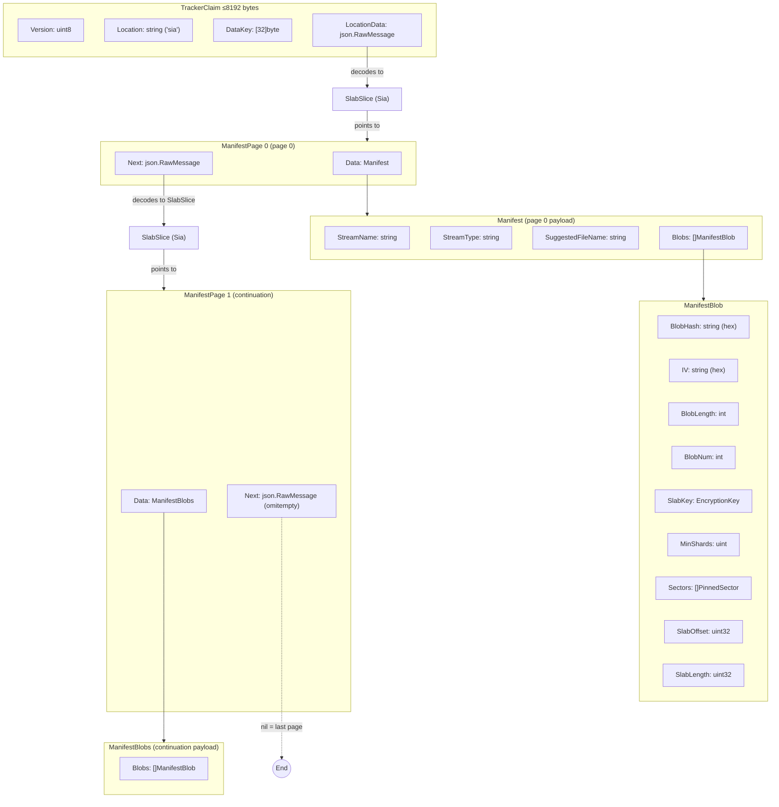

# tracker-protocol

Protocol specification for decentralized storage tracker claims. Defines the data structures that allow a client to locate, retrieve, and decrypt a file stored on a decentralized storage network (Sia, and future backends).

## Data Structure



## How It Works

A **TrackerClaim** is a self-contained, ≤8192-byte JSON descriptor embedded in a blockchain claim. It contains:

- **Version** — protocol version (currently 1)
- **Location** — storage backend identifier (`"sia"`)
- **DataKey** — AES-256 encryption key for file content
- **LocationData** — location-specific retrieval data (e.g. a Sia `SlabSlice` pointing to the first manifest page)

The claim points to a **manifest chain** — a DAG of `ManifestPage` objects stored off-chain. Each page contains blob entries mapping LBRY blob hashes to Sia slab locations, and an optional `Next` pointer to the next page. The consumer follows the chain until `Next` is nil.

### Sia Flow

1. Builder accumulates `ManifestBlob` entries (blob hash, IV, Sia slab data)
2. `PageBuilder.Plan()` divides blobs into pages
3. `PageBuilder.BuildChain()` uploads pages in reverse (last→first), wiring `Next` pointers
4. The first page's `SlabSlice` becomes the claim's `LocationData`
5. The `TrackerClaim` is published to the blockchain

## Architecture

```
tracker-protocol/
├── claim.go          # TrackerClaim, Location, MaxClaimSize
├── codec.go          # EncodeClaim, DecodeClaim, ValidateClaimSize, GenerateSchema
├── manifest.go       # ManifestPage (core paging type)
├── sia/
│   ├── sia.go        # Manifest, ManifestBlobs, ManifestBlob, encode/decode helpers
│   ├── pagebuilder.go # PageBuilder, Plan, BuildChain, FitsClaim
│   └── schema.go     # JSON Schema generation for Sia types
├── cmd/
│   └── schemas/      # CLI tool to generate JSON Schema files
└── schemas/          # Generated schemas (gitignored)
```

### Key Design Principles

- **Core is agnostic.** Core types use `json.RawMessage` for location-specific data. No backend-specific types in core.
- **No redefined types.** Backend types come from their native packages directly (e.g. `go.sia.tech/indexd/slabs`).
- **Child packages import parent, never reverse.**
- **No upload client.** Protocol defines data structures and helpers only.
- **Location is a string type.** Not a numeric enum.

## Getting Started

### Prerequisites

- Go 1.26+

### Build

```bash
go build ./...
```

### Test

```bash
go test -count=1 ./...
```

### Generate Schemas

```bash
go run ./cmd/schemas
# Writes to schemas/*.json
```

## Usage

### Building a Sia-backed claim

```go
import (
    "go.lumeweb.com/tracker-protocol/sia"
)

pb := sia.NewPageBuilder("movie.mp4", "lbryfile", "movie.mp4", dataKey)
pb.Add(sia.FromSlabSlice(slab1, blobHash1, iv1, blobLen1, 0))
pb.Add(sia.FromSlabSlice(slab2, blobHash2, iv2, blobLen2, 1))

result, err := pb.BuildChain(maxBlobsPerPage, uploadFunc)
// result.Claim is ready to publish
// result.RootSlab points to the first manifest page
// result.PageCount is the total number of pages
```

### Decoding a claim

```go
claim, err := trackerprotocol.DecodeClaim(rawJSON)
rootSlab, err := sia.DecodeRootSlab(claim)
// Fetch and decode manifest pages following the Next chain
```

## Dependencies

- `go.sia.tech/core` — Sia core types
- `go.sia.tech/indexd` — Slab/Sector types for Sia storage
- `github.com/invopop/jsonschema` — JSON Schema generation

## License

MIT
