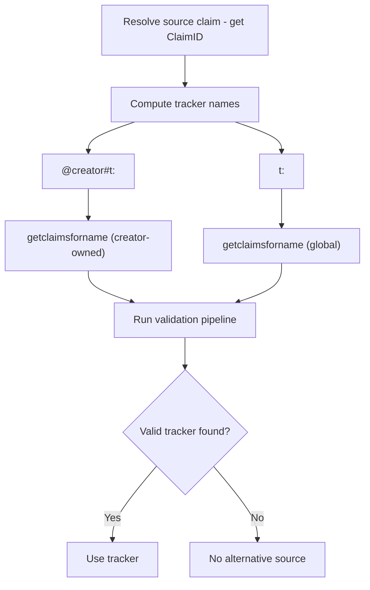
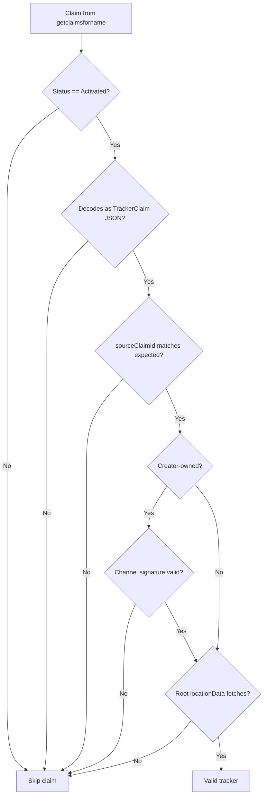
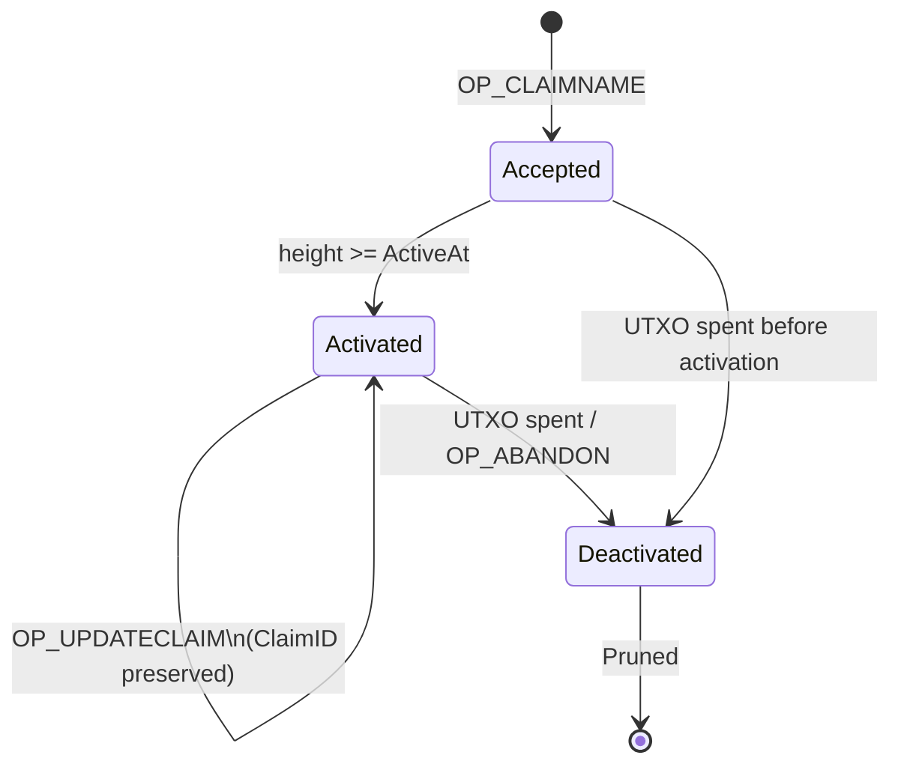

# Tracker Claim Naming Specification

**Status:** Draft
**Version:** 0

## 1. Purpose

This specification defines how tracker claims are named, discovered, and
validated on the LBRY claimtrie. A tracker claim provides an alternative
decentralized storage source for content originally published as a LBRY stream
claim.

Trackers are **supplemental**. A client always discovers the LBRY source claim
first, then queries for trackers as alternative storage mirrors.

## 2. Terminology

| Term | Definition |
|---|---|
| Source claim | The original LBRY stream claim (e.g. `@creator#my-video`) |
| Source ClaimID | 20-byte `RIPEMD160(SHA256(tx:vout))` of the source claim's outpoint |
| Tracker claim | A claim whose value is a `TrackerClaim` JSON payload |
| Claimtrie name | The on-chain name under which a claim is registered |
| Manifest | Off-chain page chain containing blob metadata and storage locations |

## 3. Naming Schemes

### 3.1 Creator-Owned Names (Preferred)

```
@creator#t:<source_claim_id_hex>
```

| Component | Description |
|---|---|
| `@creator` | LBRY channel claim (globally unique in the claimtrie) |
| `#` | Channel-scoping separator |
| `t` | Tracker prefix |
| `:` | Delimiter |
| `<source_claim_id_hex>` | 40-char lowercase hex of the source claim's 20-byte ClaimID |

The claim value **MUST** be signed by the same channel key that signed the
source claim. The channel signature is stored in the claim value bytes.
Signature verification is performed client-side.

**Claim value format (signed):**

```
[0x01] [20-byte channel ClaimID] [64-byte ECDSA signature] [payload...]
```

Only the channel private key holder can produce a valid signature that
clients will accept. The `#` separator has no special meaning in the claimtrie
- `@alice` and `@alice#t:abc` are independent nodes.

### 3.2 Global Names (Fallback)

```
t:<source_claim_id_hex>
```

| Component | Description |
|---|---|
| `t` | Tracker prefix |
| `:` | Delimiter |
| `<source_claim_id_hex>` | 40-char lowercase hex of the source claim's 20-byte ClaimID |

Any operator may post a global tracker claim. No creator endorsement is
implied. Multiple claims at the same name coexist; the claimtrie stores all
claims; ranking is by effective amount (bid + supports).

### 3.3 Third-Party Channel-Scoped Names

```
@thirdparty#t:<source_claim_id_hex>
```

Permitted. The third party's signature establishes persistent identity but
carries the same trust level as an unsigned global tracker. Clients **MUST**
treat these identically to global trackers.

### 3.4 Comparison

| Property | Creator-Owned | Global | Third-Party Scoped |
|---|---|---|---|
| Priority | 1 | 2 | 2 |
| Creator endorsement | Yes (signature) | No | No |
| Squatting resistance | Cryptographic | Economic | Cryptographic (identity only) |
| Multiple operators | No (channel owner only) | Yes | Yes |
| Discovery | Requires channel name | Deterministic from ClaimID | Requires channel name |

## 4. Discovery

### 4.1 Protocol



The client queries creator-owned names first, then global names. The ClaimID
is obtained from the source claim the client already resolved.

### 4.2 Claimtrie Constraints

The claimtrie is a key-value store with exact-match lookup only. Discovery
relies on deterministic name computation from the source ClaimID.

### 4.3 Censorship Resistance

The claimtrie is replicated on every full node. `getclaimsforname` is a local
query against the node's own database. There is no central server to seize or
pressure.

## 5. Validation Pipeline

### 5.1 Filtering Order



A claim **MUST** pass all applicable filters to be considered a valid tracker.
Filters are ordered by cost: zero-cost checks first, network operations last.

### 5.2 Download-Time Verification

Blob integrity is verified lazily during download:

1. Download a blob from the storage backend via the manifest entry.
2. Compute SHA-384 of the retrieved blob.
3. Compare against `ManifestBlob.BlobHash`.
4. On mismatch, discard the tracker as poisoned.

A poisoned tracker wastes at most one blob download before detection.

### 5.3 Claim Status



| Status | Meaning | Filter Action |
|---|---|---|
| `Activated` | Live, bid counts toward ranking | Process |
| `Accepted` | Waiting for activation delay | Skip |
| `Deactivated` | UTXO spent (abandoned) | Skip |

Activation delay for new claims at a name with an existing controlling claim:

```
delay = min(4032, (currentHeight - lastTakeoverHeight) / 32)
```

Maximum delay: 4032 blocks (~7 days). First claim at a fresh name activates
immediately (delay = 0). The delay is an anti-takeover mechanism. Anti-spam is
economic; each claim locks LBC in a UTXO.

## 6. Claim Value Format

The tracker claim value is a `TrackerClaim` JSON payload as specified in the
*Tracker Claim Data Structures Specification*, Section 3.

### 6.1 sourceClaimId

The `sourceClaimId` field is a **verification value**, not a discovery value.
The client computes the tracker name from the source ClaimID before querying.
On decode, the client verifies that `sourceClaimId` matches the expected value.

This detects:
- Mismatched claims at the same name
- Claims updated to point at different content

### 6.2 Size Budget

On-chain claim value **MUST NOT** exceed 8192 bytes (LBRY consensus limit).

For a detailed size budget breakdown, see the *Tracker Claim Data Structures
Specification*, Section 6.

## 7. Ranking

When multiple valid trackers exist, clients rank by:

1. **Creator-owned first.** `@creator#t:<id>` trackers carry the creator's
   cryptographic endorsement.
2. **Effective amount.** Within each tier, sort by bid + supports. Higher
   stake signals confidence. All trackers must pass validation regardless of
   stake.
3. **Recency.** Prefer recently updated trackers (via `OP_UPDATECLAIM`). Stale
   trackers with expired storage contracts fail at filter step 5.

## 8. Lifecycle

### 8.1 Creation

1. Download the LBRY source stream (or obtain blobs directly).
2. Upload each blob to the storage backend.
3. Build the manifest page chain (see *Sia Backend Specification*, Section 4).
4. Construct a `TrackerClaim` with root location pointer, data key, and source
   ClaimID.
5. Post on-chain:
   - Global: `OP_CLAIMNAME` at name `t:<source_claim_id_hex>`
   - Creator-owned: `OP_CLAIMNAME` at name `@creator#t:<source_claim_id_hex>`,
     signed with the channel key

### 8.2 Update

When storage data expires or moves:

1. Re-upload blobs to the storage backend.
2. Rebuild the manifest page chain.
3. `OP_UPDATECLAIM`: spends the old claim UTXO, creates a new one with the
   same ClaimID but updated value (new `locationData` pointer).

The ClaimID persists across updates. The `sourceClaimId` field remains
unchanged.

### 8.3 Abandon

`OP_ABANDONCLAIM` (spending the claim UTXO without replacement) removes the
tracker. The claim enters `Deactivated` status and is eventually pruned.

## 9. Security Properties

| Threat | Mitigation |
|---|---|
| Name squatting (global) | Multiple claims coexist; squatting doesn't remove others |
| Name squatting (creator) | Cryptographically impossible without channel key |
| Spoofed tracker data | Download-time SHA-384 verification per blob |
| Stale/expired trackers | Storage fetch fails at filter step 5; client skips |
| Spam flood | Economic: each claim locks LBC in a UTXO |
| Censorship | Claimtrie replicated on every full node; no central server |
| Takeover attack | Activation delay (up to ~7 days) slows displacement |
| Forged creator signature | ECDSA verification against channel public key |

## 10. RPC Reference

| RPC | Purpose |
|---|---|
| `getclaimsforname <name>` | Returns all claims at a name (primary discovery) |
| `getclaimsfornamebyid <name> <claimid>` | Returns a specific claim by ID |
| `getclaimsfornamebybid <name> <bid>` | Returns a claim by bid position |
| `getclaimsfornamebyseq <name> <sequence>` | Returns a claim by index sequence |
| `getchangesinblock <height>` | Returns all names changed in a block |
| `normalize <name>` | Returns the normalized form of a claim name |
