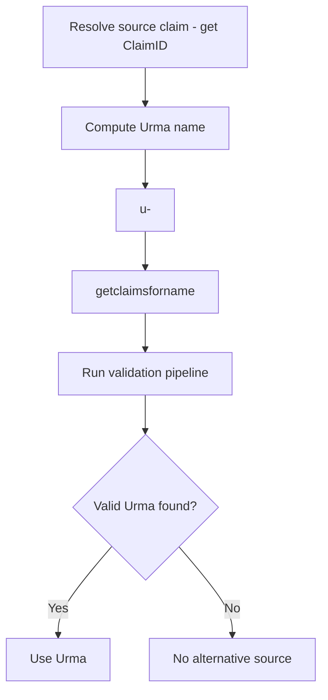
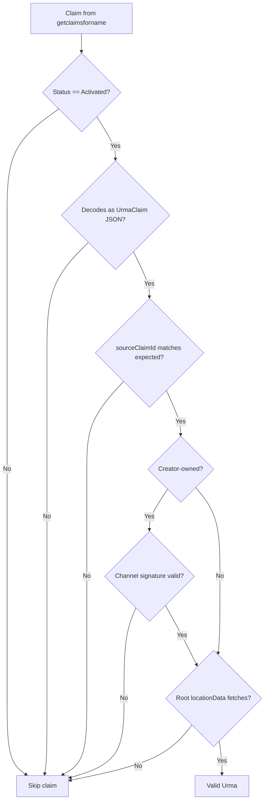
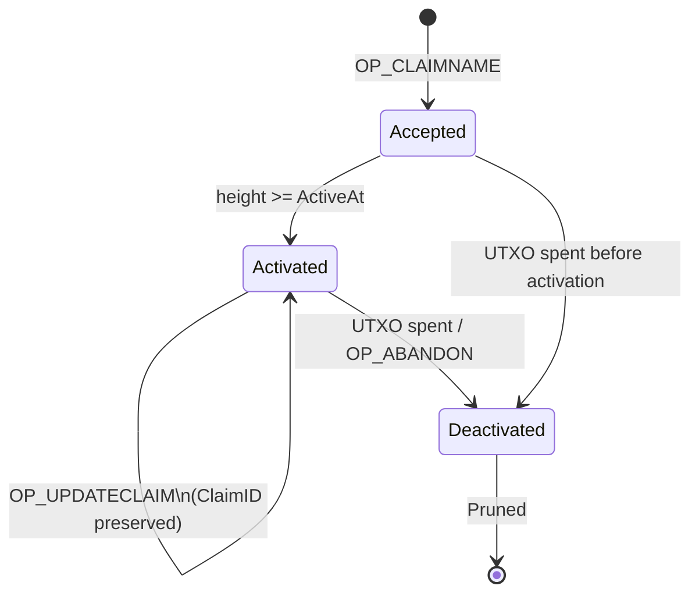

# Urma claim Naming Specification

**Status:** Draft
**Version:** 0

## 1. Purpose

This specification defines how Urma claims are named, discovered, and
validated on the LBRY claimtrie. A Urma claim provides an alternative
decentralized storage source for content originally published as a LBRY stream
claim.

Urmas are **supplemental**. A client always discovers the LBRY source claim
first, then queries for Urmas as alternative storage mirrors.

## 2. Terminology

| Term | Definition |
|---|---|
| Source claim | The original LBRY stream claim |
| Source ClaimID | 20-byte `RIPEMD160(SHA256(tx:vout))` of the source claim's outpoint |
| Urma claim | A claim whose value is a `UrmaClaim` JSON payload |
| Claimtrie name | The on-chain name under which a claim is registered |
| Manifest | Off-chain page chain containing blob metadata and storage locations |
| Channel claim | A LBRY channel claim (e.g. `@creator`) |
| Signing channel | The channel whose private key signs a claim value |

## 2.1. Claim Name Character Restrictions

LBRY consensus rules prohibit the following characters in claim names:
`=`, `&`, `#`, `:`, `$`, `%`, `?`, `/`, `;`, `\`, and control characters.
Urma claim names **MUST** comply with these restrictions.

## 2.2. Channel Scoping

On the claimtrie, channel claims (`@creator`) and stream claims (`my-video`)
are registered as independent top-level keys. The association between a stream
claim and a channel is established cryptographically through the signature
envelope within the claim value.

The `@creator#my-video` syntax is a client-side URI convention for resolving
claims by channel and name.

Channel signature verification is performed client-side. The claimtrie stores
the claim value as opaque bytes and enforces only size constraints.

## 2.3. Claim Value Format

The Urma claim value uses LBRY's signature envelope. The payload is
UrmaClaim JSON (see *Urma claim Data Structures Specification*,
Section 3) instead of protobuf. Standard LBRY clients treat the value as
opaque claim metadata; Urma clients parse the JSON payload.

### Unsigned (global Urmas)

```
[0x00] [UrmaClaim JSON bytes]
```

### Signed (creator-owned or third-party)

```
[0x01] [20-byte channel ClaimID] [64-byte ECDSA signature] [UrmaClaim JSON bytes]
```

### Signature Computation

The signature digest is computed as:

```
digest = SHA-256(tx_input_0_hash || channel_claim_id || Urma_claim_json_bytes)
```

| Component | Description |
|---|---|
| `tx_input_0_hash` | 36-byte OutPoint (32-byte txid + 4-byte vout) of the first transaction input |
| `channel_claim_id` | 20-byte ClaimID of the signing channel |
| `Urma_claim_json_bytes` | Raw bytes of the UrmaClaim JSON payload (starting at byte 85) |

The signature is a 64-byte compact ECDSA (r||s) signature over the SECP256k1
curve. The signing channel's public key is fetched from its channel claim
(see Verification, step 5).

### Verification

To verify a signed Urma claim:

1. Read byte 0. If `0x00`, the claim is unsigned. If `0x01`, proceed.
2. Read bytes 1-20: the signing channel ClaimID.
3. Read bytes 21-84: the ECDSA signature.
4. Read bytes 85+: the UrmaClaim JSON payload.
5. Fetch the signing channel claim and extract its public key.
6. Recompute `SHA-256(tx_input_0_hash || channel_claim_id || json_bytes)`.
7. Verify the signature against the digest using the channel public key.

### Update Behavior

The signature digest includes `tx_input_0_hash`, which is specific to the
transaction that created the claim. When a claim is updated via
`OP_UPDATECLAIM`, a new transaction is created with a different first input,
invalidating the previous signature. The channel private key **MUST** be
available to re-sign the claim value on each update.

## 3. Naming Schemes

### 3.1 Creator-Owned Names (Preferred)

```
u-<source_claim_id_hex>
```

The Urma claim is posted as a signed claim value, with the signing channel
set to the same channel that signed the source claim. The claim name is the
same as the global name; the channel association is established through the
signature envelope (see Section 2.3).

| Component | Description |
|---|---|
| `u` | Urma prefix |
| `-` | Delimiter |
| `<source_claim_id_hex>` | 40-char lowercase hex of the source claim's 20-byte ClaimID |

The claim value **MUST** be signed by the same channel key that signed the
source claim (see Section 2.3). Signature verification is performed
client-side.

The channel private key holder produces the signature that clients verify.

### 3.2 Global Names (Fallback)

```
u-<source_claim_id_hex>
```

Any operator may post a global Urma claim. The claim value is unsigned
(`[0x00][payload]`). No creator endorsement is implied. Multiple claims at
the same name coexist; the claimtrie stores all claims; ranking is by
effective amount (bid + supports).

### 3.3 Third-Party Channel-Signed Names

A third-party operator may post a Urma claim signed by their own channel.
The third party's signature establishes persistent identity and carries the
same trust level as an unsigned global Urma. Clients **MUST** treat these
identically to global Urmas.

### 3.4 Comparison

| Property | Creator-Owned | Global | Third-Party Signed |
|---|---|---|---|
| Priority | 1 | 2 | 2 |
| Creator endorsement | Yes (signature) | No | No |
| Squatting resistance | Cryptographic | Economic | Cryptographic (identity only) |
| Multiple operators | Channel owner only | Yes | Yes |
| Discovery | Signed by source channel | Deterministic from ClaimID | Deterministic from ClaimID |
| Claim name | Same as global | `u-<hex>` | Same as global |

## 4. Discovery

### 4.1 Protocol



The client queries `getclaimsforname` with the deterministic Urma name.
Creator-owned Urmas are identified by checking byte 0 of the claim value
(`0x01` = signed) and verifying the channel ClaimID matches the source
claim's signing channel (see Section 2.3). The ClaimID is obtained from the
source claim the client already resolved.

### 4.2 Claimtrie Constraints

The claimtrie is a key-value store with exact-match lookup only. Discovery
relies on deterministic name computation from the source ClaimID.

### 4.3 Censorship Resistance

The claimtrie is replicated on every full node. `getclaimsforname` is a local
query against the node's own database. There is no central server to seize or
pressure.

## 5. Validation Pipeline

### 5.1 Filtering Order



A claim **MUST** pass all applicable filters to be considered a valid Urma.
Filters are ordered by cost: zero-cost checks first, network operations last.

### 5.2 Download-Time Verification

Blob integrity is verified lazily during download:

1. Download a blob from the storage backend via the manifest entry.
2. Compute SHA-384 of the retrieved blob.
3. Compare against `ManifestBlob.BlobHash`.
4. On mismatch, discard the Urma as poisoned.

A poisoned Urma wastes at most one blob download before detection.

### 5.3 Claim Status



| Status | Meaning | Filter Action |
|---|---|---|
| `Activated` | Live, bid counts toward ranking | Process |
| `Accepted` | Waiting for activation delay | Skip |
| `Deactivated` | UTXO spent (abandoned) | Skip |

Activation delay for new claims at a name with an existing controlling claim:

```
delay = min(4032, (currentHeight - lastTakeoverHeight) / 32)
```

Maximum delay: 4032 blocks (~7 days). First claim at a fresh name activates
immediately (delay = 0). The delay is an anti-takeover mechanism. Anti-spam is
economic; each claim locks LBC in a UTXO.

## 6. Claim Value Format

The Urma claim value uses LBRY's signature envelope as specified in
Section 2.3. The payload is a `UrmaClaim` JSON object (see *Urma claim
Data Structures Specification*, Section 3).

### 6.1 sourceClaimId

The `sourceClaimId` field is a **verification value**, not a discovery value.
The client computes the Urma name from the source ClaimID before querying.
On decode, the client verifies that `sourceClaimId` matches the expected value.

This detects:
- Mismatched claims at the same name
- Claims updated to point at different content

### 6.2 Size Budget

The on-chain claim script (as measured by LBRY consensus, excluding the P2PKH
script pubkey part) **MUST NOT** exceed `MaxClaimScriptSize` (8192 bytes). The
claim script comprises:

```
OP_CLAIMNAME <name> <value> OP_2DROP OP_DROP
```

The size limit covers all of these components, not just the claim value.

**Fixed overhead (46 bytes):**

| Component | Bytes |
|---|---|
| `OP_CLAIMNAME` opcode | 1 |
| Name push prefix | 1 |
| Urma claim name (`u-` + 40 hex) | 42 |
| `OP_2DROP` opcode | 1 |
| `OP_DROP` opcode | 1 |

**Envelope overhead:**

| Envelope type | Overhead | Layout |
|---|---|---|
| Unsigned | 1 | `[0x00]` version byte |
| Signed | 85 | `[0x01]` version + 20-byte channel ClaimID + 64-byte signature |

**Value push prefix** is variable (1-5 bytes), matching lbcd's canonical data
push encoding for the envelope value.

**Maximum JSON payload:**

| Envelope type | Max JSON payload (bytes) |
|---|---|
| Unsigned | 8142 |
| Signed | 8058 |

Both assume a 3-byte value push prefix, which applies when the envelope exceeds
255 bytes (the typical case for Urma claims).

## 7. Ranking

When multiple valid Urmas exist, clients rank by:

1. **Creator-owned first.** Urmas signed by the source claim's channel
   carry the creator's cryptographic endorsement.
2. **Effective amount.** Within each tier, sort by bid + supports. Higher
   stake signals confidence. All Urmas must pass validation regardless of
   stake.
3. **Recency.** Prefer recently updated Urmas (via `OP_UPDATECLAIM`). Stale
   Urmas with expired storage contracts fail at filter step 5.

## 8. Lifecycle

### 8.1 Creation

1. Download the LBRY source stream (or obtain blobs directly).
2. Upload each blob to the storage backend.
3. Build the manifest page chain (see *Sia Backend Specification*, Section 4).
4. Construct a `UrmaClaim` with root location pointer, data key, and source
   ClaimID.
5. Post on-chain:
   - Global: unsigned `OP_CLAIMNAME` at name `u-<source_claim_id_hex>`
   - Creator-owned: signed `OP_CLAIMNAME` at name `u-<source_claim_id_hex>`,
     signed with the source claim's channel key

### 8.2 Update

When storage data expires or moves:

1. Re-upload blobs to the storage backend.
2. Rebuild the manifest page chain.
3. `OP_UPDATECLAIM`: spends the old claim UTXO, creates a new one with the
   same ClaimID but updated value (new `locationData` pointer).
4. For signed claims: re-sign the claim value with the channel private key
   (see Section 2.3, Update Behavior).

The ClaimID persists across updates. The `sourceClaimId` field remains
unchanged.

### 8.3 Abandon

`OP_ABANDONCLAIM` (spending the claim UTXO without replacement) removes the
Urma. The claim enters `Deactivated` status and is eventually pruned.

## 9. Security Properties

| Threat | Mitigation |
|---|---|
| Name squatting (global) | Multiple claims coexist; squatting doesn't remove others |
| Name squatting (creator) | Cryptographically impossible without channel key |
| Spoofed Urma data | Download-time SHA-384 verification per blob |
| Stale/expired Urmas | Storage fetch fails at filter step 5; client skips |
| Spam flood | Economic: each claim locks LBC in a UTXO |
| Censorship | Claimtrie replicated on every full node; exact-match resolution against local data |
| Takeover attack | Activation delay (up to ~7 days) slows displacement |
| Forged creator signature | ECDSA verification against channel public key |

## 10. RPC Reference

| RPC | Purpose |
|---|---|
| `getclaimsforname <name>` | Returns all claims at a name (primary discovery) |
| `getclaimsfornamebyid <name> <claimid>` | Returns a specific claim by ID |
| `getclaimsfornamebybid <name> <bid>` | Returns a claim by bid position |
| `getclaimsfornamebyseq <name> <sequence>` | Returns a claim by index sequence |
| `getchangesinblock <height>` | Returns all names changed in a block |
| `normalize <name>` | Returns the normalized form of a claim name |
