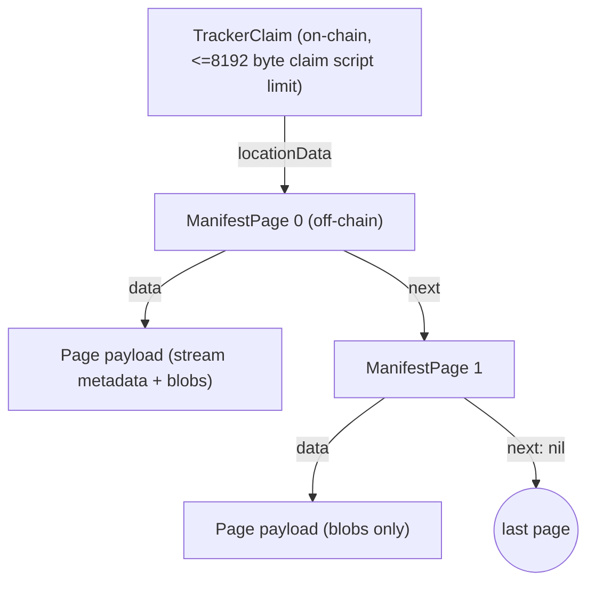
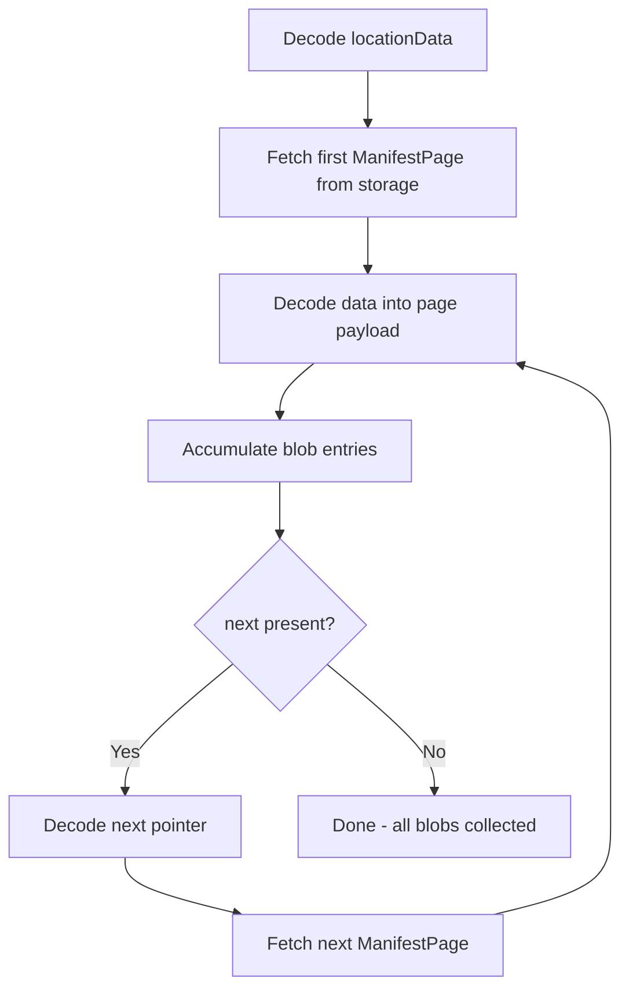

# Tracker Claim Data Structures Specification

**Status:** Draft
**Version:** 0

## 1. Purpose

This specification defines the core data structures and serialization formats
for tracker protocol claims. The protocol is storage-agnostic: a `location`
field identifies the backing network, and `locationData` carries
location-specific retrieval data as opaque JSON.

## 2. Architecture



### Layer Separation

| Layer | Responsibility |
|---|---|
| Core | `TrackerClaim`, `ManifestPage`, serialization, size validation |
| Backend | Manifest types, page construction, encode/decode helpers |

Core types use opaque JSON for location-specific data. Backend types are
defined by their respective specifications.

## 3. TrackerClaim

### 3.1 Structure

| Field | Type | JSON Key | Description |
|---|---|---|---|
| `version` | uint8 | `version` | Protocol version (currently 0) |
| `location` | string | `location` | Storage backend identifier |
| `sourceClaimId` | string (hex) | `sourceClaimId` | Source claim ClaimID |
| `dataKey` | array of 32 uint8 | `dataKey` | AES-256 encryption key |
| `locationData` | object | `locationData` | Backend-specific retrieval data |

### 3.2 Example

```json
{
  "version": 0,
  "location": "sia",
  "sourceClaimId": "a1b2c3d4e5f60102030405060708090a0b0c0d0e",
  "dataKey": [66, 0, 0, 0, 0, 0, 0, 0, 0, 0, 0, 0, 0, 0, 0, 0, 0, 0, 0, 0, 0, 0, 0, 0, 0, 0, 0, 0, 0, 0, 0, 0],
  "locationData": { }
}
```

### 3.3 Field Semantics

#### version

Protocol version. Currently `0`. Clients **MUST** reject claims with an
unknown version.

#### location

Storage backend identifier. Currently supported: `"sia"`. Clients **MUST**
reject claims with an unknown location.

#### sourceClaimId

The 20-byte ClaimID of the LBRY source claim, serialized as a 40-character
lowercase hex string. Derived from the source claim's outpoint:
`RIPEMD160(SHA256(tx:vout))`.

Verification value: the client computes the tracker name from the source
ClaimID before querying, then validates this field on decode.

#### dataKey

AES-256 encryption key for file content. Serialized as a JSON array of 32
integers, occupying 66 bytes in the serialized output.

#### locationData

Backend-specific retrieval data as opaque JSON. The schema depends on
`location`. The backend specification defines the structure.

## 4. Constants

| Constant | Value | Description |
|---|---|---|
| Protocol version | `0` | Current protocol version |
| Max claim script size | `8192` | Maximum on-chain claim script size in bytes (lbcd consensus, excludes P2PKH) |
| Source ClaimID length | `20` | Length of a LBRY ClaimID in bytes |
| Sia location identifier | `"sia"` | Storage backend identifier for Sia |

## 5. ManifestPage

### 5.1 Structure

| Field | Type | JSON Key | Description |
|---|---|---|---|
| `data` | object | `data` | Backend-specific manifest payload |
| `next` | object | `next` (omitted on last page) | Backend-specific pointer to next page |

### 5.2 Page Chain

The `TrackerClaim.locationData` field points to the first `ManifestPage` stored
off-chain. Each page contains:

- `data`: backend-specific payload (defined by the backend specification)
- `next`: backend-specific pointer to the next page. Omitted on the last page.

Clients follow the chain until `next` is absent, accumulating blob entries
across all pages.



### 5.3 Page 0 vs Continuation Pages

Stream metadata lives exclusively on page 0. Continuation pages carry only
blob entries. The backend specification defines the payload types for each
page.

## 6. Size Budget

The on-chain claim script (as measured by LBRY consensus, excluding the P2PKH
script pubkey part) **MUST NOT** exceed `MaxClaimScriptSize` (8192 bytes). The
claim script covers `OP_CLAIMNAME`, the claim name, the claim value (envelope
+ JSON), and control opcodes. See *Tracker Claim Naming Specification*,
Section 6.2 for the full size budget breakdown.

The TrackerClaim JSON payload is a subset of the claim value. The approximate
JSON payload composition:

| Component | Size (bytes) |
|---|---|
| JSON structure overhead | ~68 |
| `version` | 1 |
| `location` | 5 |
| `sourceClaimId` | 42 |
| `dataKey` | 66 |
| `locationData` (root pointer) | 200-400 |
| **Total JSON** | **~380-580** |

Measured: 426 bytes with a single-slab Sia test payload. Manifest metadata is
stored off-chain in the manifest page chain.

Maximum JSON payload that fits on-chain:

| Envelope type | Max JSON payload (bytes) |
|---|---|
| Unsigned | 8142 |
| Signed | 8058 |

## 7. Location Extensibility

New storage backends **MAY** be added without modifying core types:

1. Register a new location identifier (e.g. `"ipfs"`)
2. Define the `locationData` schema for the new backend
3. Define manifest page payload types

Core types remain backend-agnostic. `ManifestPage` uses opaque JSON for both
`data` and `next`, so new backends define their own page payload structures.

## 8. Serialization

TrackerClaim **MUST** be serialized as JSON. Implementations **SHOULD** provide:

- Encode: TrackerClaim -> JSON bytes
- Decode: JSON bytes -> TrackerClaim
- Size validation: verify total on-chain claim script size <= MaxClaimScriptSize (8192 bytes), accounting for script overhead, envelope overhead, value push prefix, and JSON payload
- JSON Schema generation for validation
