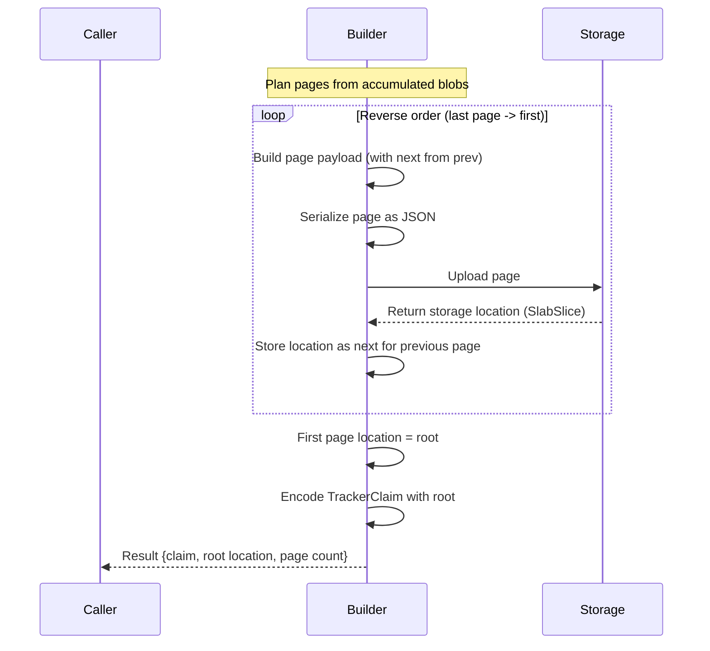

# Sia Backend Specification

**Status:** Draft
**Version:** 0

## 1. Purpose

This specification defines the Sia backend for the tracker protocol. It
covers the `locationData` schema, manifest page payload types, blob entry
structure, and the page chain construction protocol.

## 2. LocationData

For `location: "sia"`, the `TrackerClaim.locationData` field contains a
serialized SlabSlice pointing to the first `ManifestPage` object stored on
Sia. The SlabSlice **MUST** contain:

| Field | Type | Description |
|---|---|---|
| `encryptionKey` | string (base64) | Slab encryption key |
| `minShards` | uint | Minimum sectors required for recovery |
| `sectors` | array | Pinned sector references |
| `offset` | uint32 | Byte offset into slab data |
| `length` | uint32 | Number of data bytes in the slice |

## 3. Manifest Page Payloads

Page 0 (first page) **MUST** contain a `Manifest` payload. Continuation pages
**MUST** contain a `ManifestBlobs` payload.

### 3.1 Manifest (Page 0)

| Field | Type | JSON Key | Description |
|---|---|---|---|
| Stream name | string | `streamName` | Original stream name |
| Stream type | string | `streamType` | LBRY stream type (typically `"lbryfile"`) |
| Suggested file name | string | `suggestedFileName` | Suggested file name |
| Blobs | array of ManifestBlob | `blobs` | Blob entries for this page |

### 3.2 ManifestBlobs (Continuation)

| Field | Type | JSON Key | Description |
|---|---|---|---|
| Blobs | array of ManifestBlob | `blobs` | Blob entries for this page |

### 3.3 ManifestBlob

Each blob entry carries both Sia retrieval data and LBRY compatibility data.
Sia fields are flattened rather than embedded as a nested SlabSlice to avoid
ambiguity between Sia offset/length and LBRY blob length.

| Field | Type | JSON Key | Description |
|---|---|---|---|
| Blob hash | string (hex) | `blobHash` | SHA-384 hash of encrypted LBRY blob |
| IV | string (hex) | `iv` | AES IV for blob content |
| Blob length | int | `blobLength` | LBRY blob size in bytes (max 2 MiB) |
| Blob number | int | `blobNum` | Position in stream (0-indexed) |
| Slab key | string (base64) | `slabKey` | Sia slab encryption key |
| Min shards | uint | `minShards` | Minimum sectors for recovery |
| Sectors | array | `sectors` | Pinned sectors for this blob's slab |
| Slab offset | uint32 | `slabOffset` | Byte offset into slab data |
| Slab length | uint32 | `slabLength` | Number of data bytes in slab slice |

## 4. Page Chain Construction

Pages **MUST** be built in reverse order: last page first, first page last.
This allows each page's `next` pointer to be populated with the storage
location of the previously uploaded page.

### 4.1 Construction Algorithm

1. Divide accumulated blobs into pages of at most `maxBlobsPerPage` blobs each.
2. Starting from the last page, for each page:
   a. Build the page payload (`Manifest` for page 0, `ManifestBlobs` otherwise).
   b. If a subsequent page exists, embed its storage location as `next`.
   c. Serialize the page as JSON.
   d. Upload to Sia.
   e. Record the resulting storage location.
3. The first page's storage location becomes the root in `TrackerClaim.locationData`.

### 4.2 Size Estimation

The total on-chain claim script (including opcodes, name, envelope, and JSON
payload) **MUST NOT** exceed `MaxClaimScriptSize` (8192 bytes). Before
uploading, implementations **SHOULD** estimate the total on-chain size
(including script overhead, envelope overhead, variable value push prefix,
and JSON payload) to verify it fits within the limit.

## 5. Location Extensibility

This specification defines the Sia backend. Additional storage backends **MAY**
be specified following the same pattern:

1. Define the `locationData` schema for the new backend.
2. Define manifest page payload types.
3. Define the page chain construction protocol.

Core types (`TrackerClaim`, `ManifestPage`) remain unchanged; they use opaque
JSON for backend-specific fields.
